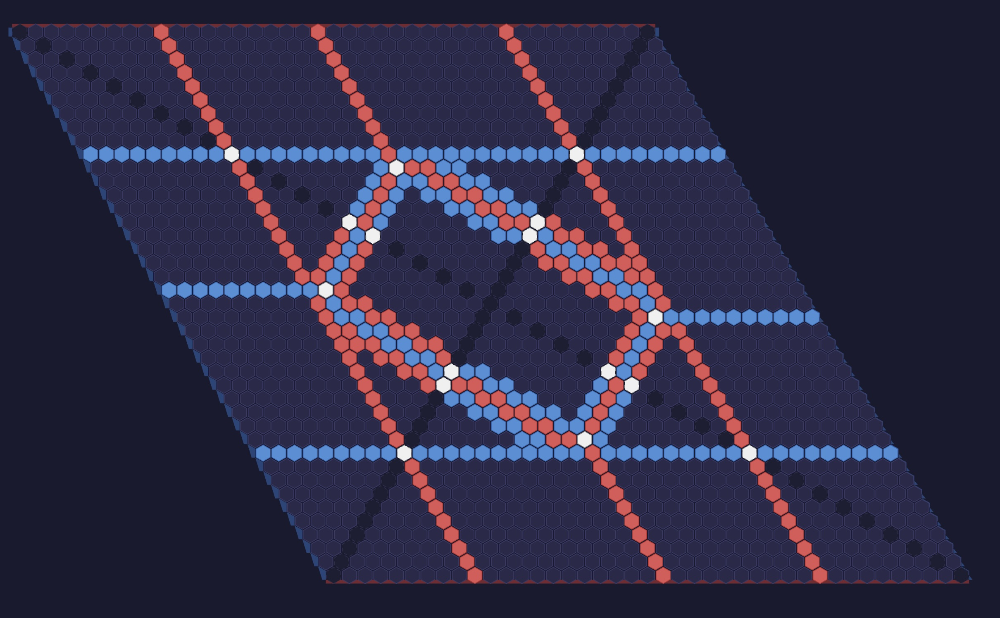

https://vitamintk.github.io/hex-proof-playground/

Made entirely using Claude Code.

Playground for making symmetric Hex configurations. Motivated by the quest to find an odd-sized board symmetric over both diagonals where playing in the center is *not* winning [influenced by [this stack exchange question/answer](https://cstheory.stackexchange.com/a/53011/53481)].

I found such a board using the tool:

white tiles are empty, but are highlighted to show that they are crucial tiles.

It wasn't obvious to me that such a board exists. In fact, I thought it was possible that it could be proven that such a board doesn't exist, which would immediately imply that playing center on an empty odd-sized board is a winning first move.
